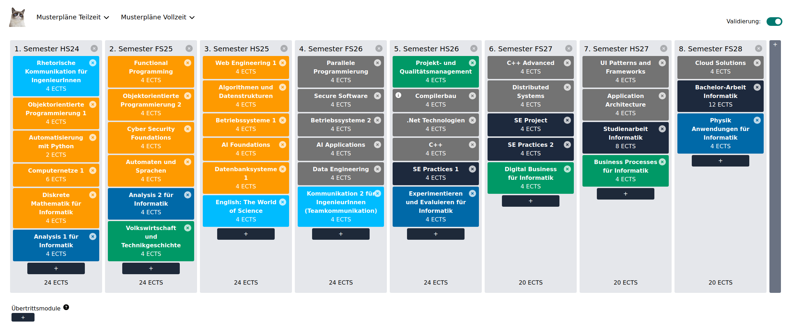
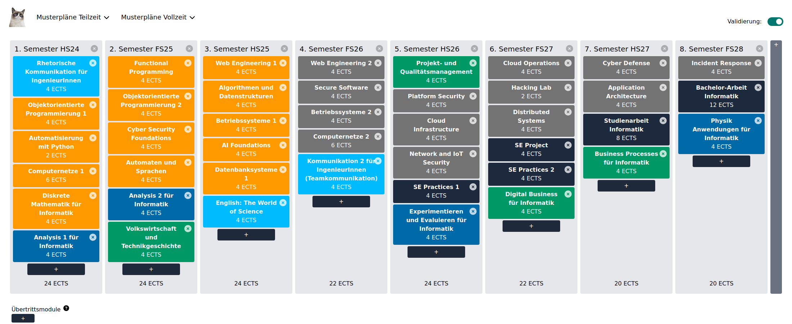
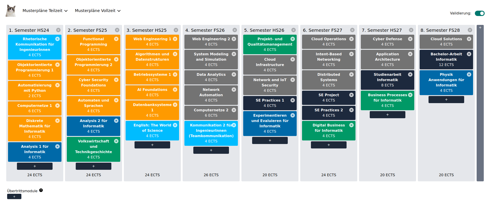
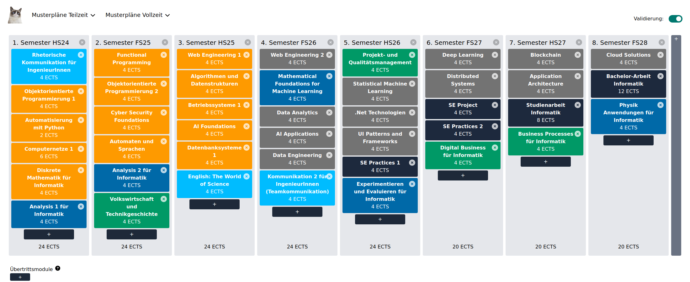

# Moduleplan
The page [lost.university](https://lost.university/) helps you to plan your studies and semesters. But often there is a problem to save the links in a proper way. Therefore this solution was implemented to have a picture for each link in the readme.

***Be aware that the ````Readme.md```` always gets overwritten on each pipeline run***

## Recent plan
The following pictures describes the modulplan for each specialization.
### Software Engineering
[](https://lost.university/#/plan/RheKoI_OOP1_AutPy_CN1_DMI_An1I-FP_OOP2_CySec_AutoSpr_An2I_VwlTg-WE1_AlgDat_Bsys1_AIFo_Dbs1_EnglScience-ParProg_SecSoW_Bsys2_AIAp_DatEng_KommIng2-PmQm_CoBau_MsTe_CPl_SEP1_ExEv-CPlA_DSy_SEProj_SEP2_DigBusI-UIP_AppArch_SAI21_WI2-CldSol_BAI21_PhAI?startSemester=HS24)

### Cyber Security
[](https://lost.university/#/plan/RheKoI_OOP1_AutPy_CN1_DMI_An1I-FP_OOP2_CySec_AutoSpr_An2I_VwlTg-WE1_AlgDat_Bsys1_AIFo_Dbs1_EnglScience-WE2_SecSoW_Bsys2_CN2_KommIng2-PmQm_PlFSec_CldInf_NIoSec_SEP1_ExEv-CldOp_HackL_DSy_SEProj_SEP2_DigBusI-CyDef_AppArch_SAI21_WI2-IncResp_BAI21_PhAI?startSemester=HS24)

### Network and Cloud Infrastructure
[](https://lost.university/#/plan/RheKoI_OOP1_AutPy_CN1_DMI_An1I-FP_OOP2_CySec_AutoSpr_An2I_VwlTg-WE1_AlgDat_Bsys1_AIFo_Dbs1_EnglScience-WE2_SModSim_DatAna_NetAut_CN2_KommIng2-PmQm_CldInf_NIoSec_SEP1_ExEv-CldOp_IBN_DSy_SEProj_SEP2_DigBusI-CyDef_AppArch_SAI21_WI2-CldSol_BAI21_PhAI?startSemester=HS24)

### Data Science
[](https://lost.university/#/plan/RheKoI_OOP1_AutPy_CN1_DMI_An1I-FP_OOP2_CySec_AutoSpr_An2I_VwlTg-WE1_AlgDat_Bsys1_AIFo_Dbs1_EnglScience-WE2_MathFML_DatAna_AIAp_DatEng_KommIng2-PmQm_ML_MsTe_UIP_SEP1_ExEv-DL_DSy_SEProj_SEP2_DigBusI-BlCh_AppArch_SAI21_WI2-CldSol_BAI21_PhAI?startSemester=HS24)

## How to use this repository
In the ````README.tmpl.md````file you need to add the links which should be generated. Then the github ci will generate the ````Readme.md````file.